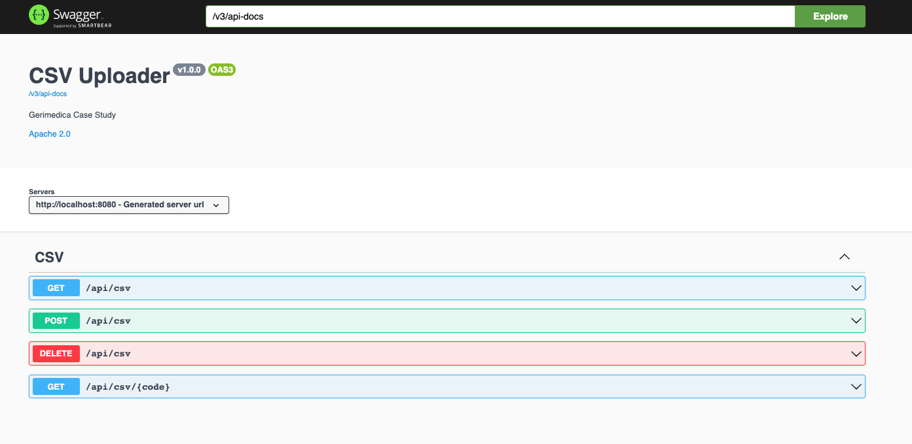
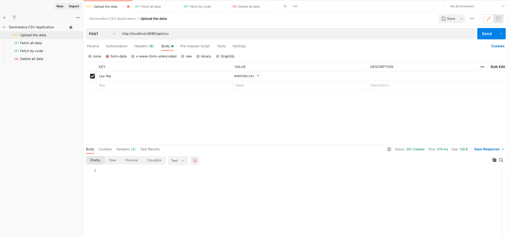

<h1 align="left"> Gerimedica Case Study </h1>

<h3 align="left">Backend Application </h3>

### Description

This service application provides endpoints for uploading and getting a csv file with a predefined format.

## Tech Stack

* Java 11
* Spring Boot 2.7.0
* Maven
* JUnit 5 and Mockito for unit tests
* H2 in-memory db used for data storage
* Docker for containerization

## API Usage

#### Swagger



#### Postman



## How to Run

Clone the project

```bash
   git clone https://github.com/onurcelikeng/gerimedica-case-study.git
```

Go to project directory

```bash
   cd gerimedica-case-study-main
```

Run the build.sh and start.sh script

```bash
   sh build.sh
   sh start.sh
```

Open web browser and go to the swagger endpoint

```bash
   http://localhost:8080/swagger-ui/index.html?configUrl=/v3/api-docs/swagger-config#/
```

For sample requests, import postman collection json (.\postman\Gerimedica CSV Application.postman_collection.json) to the
postman application. Run endpoints with the following order.

```bash
   1 Upload the data
   2 Fetch all data
   3 Fetch by code
   4 Delete all data
```

H2 database admin login

```bash
    http://localhost:8080/h2-console/login.jsp
```